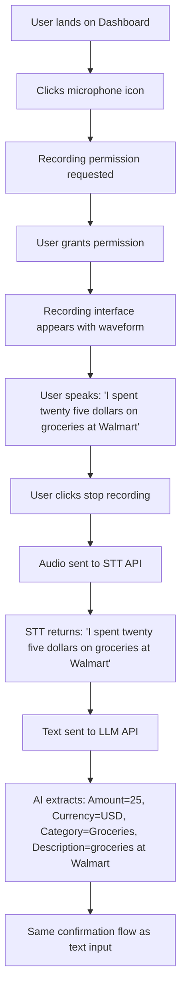
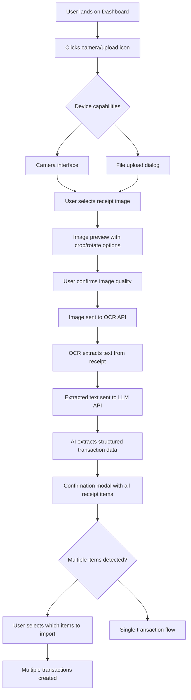
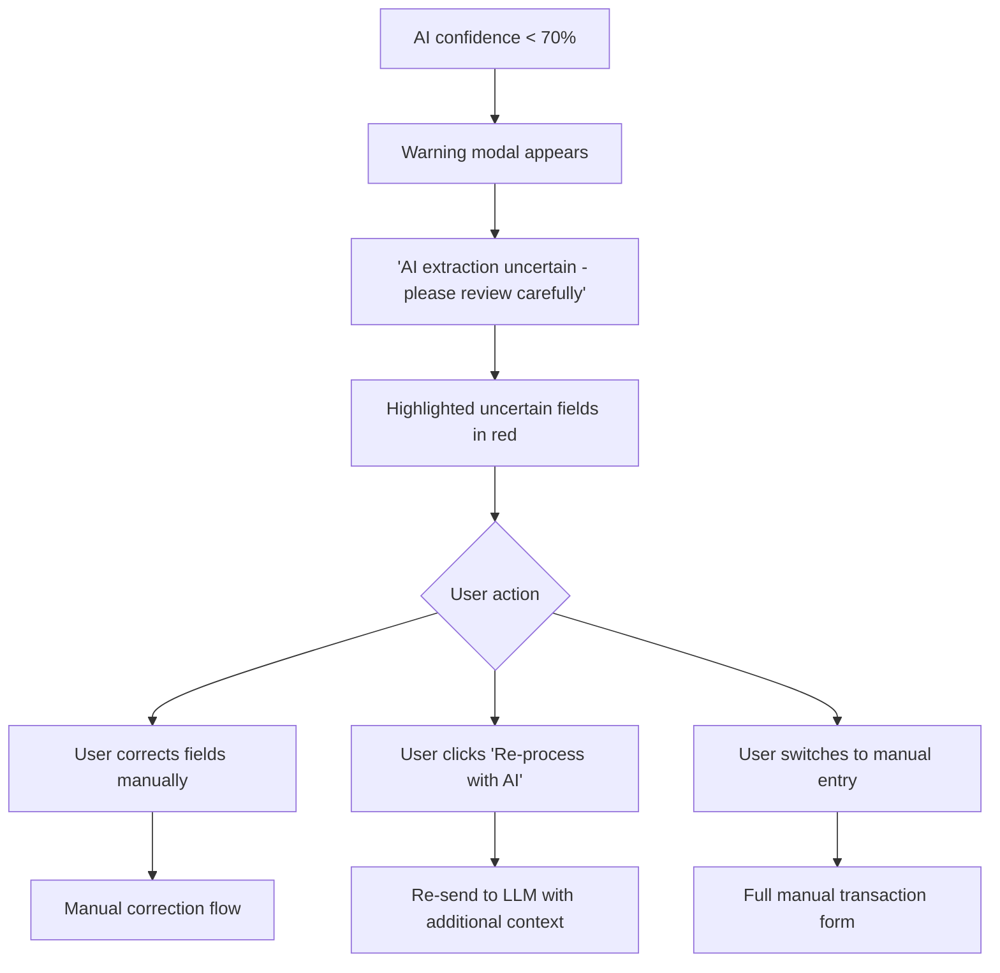
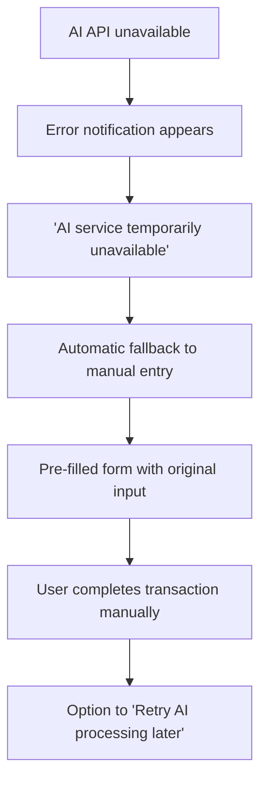
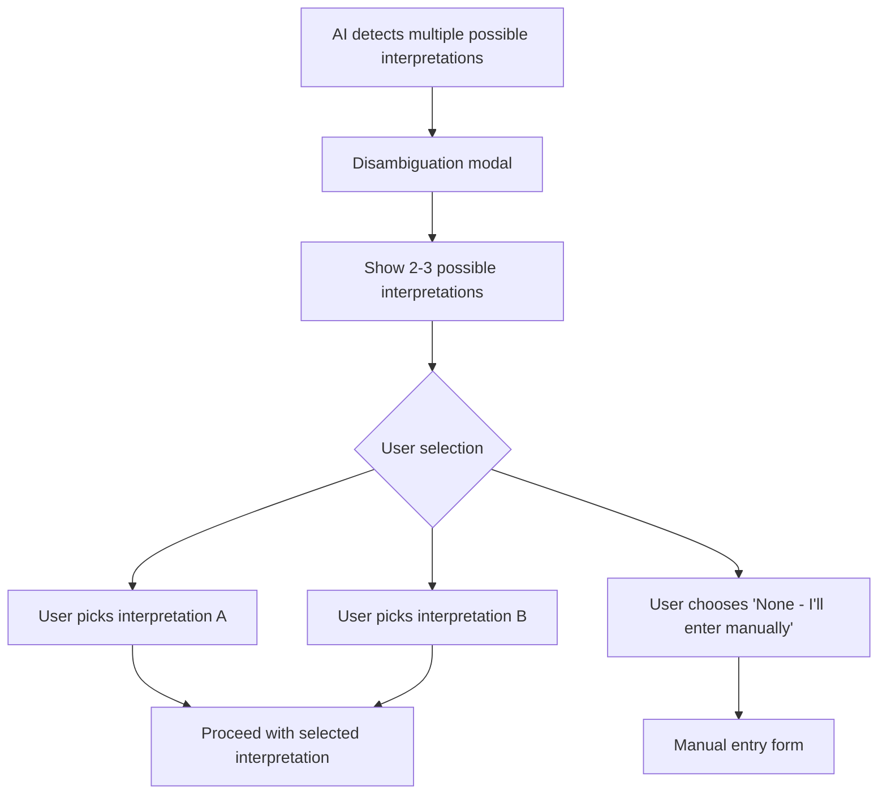
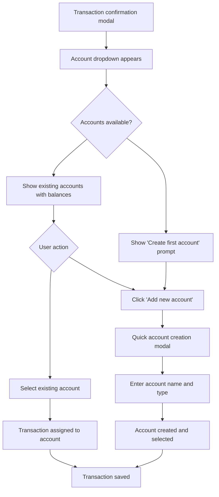
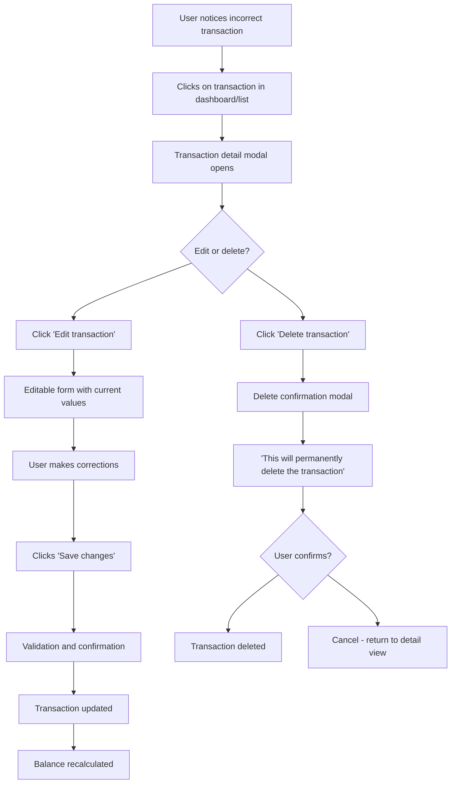
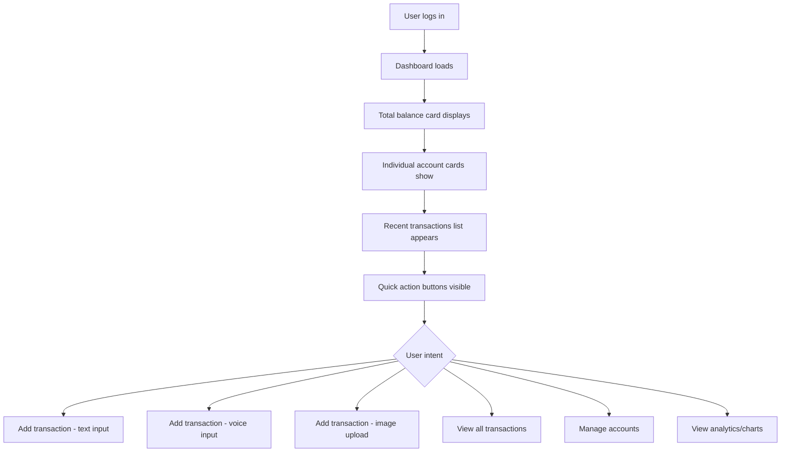
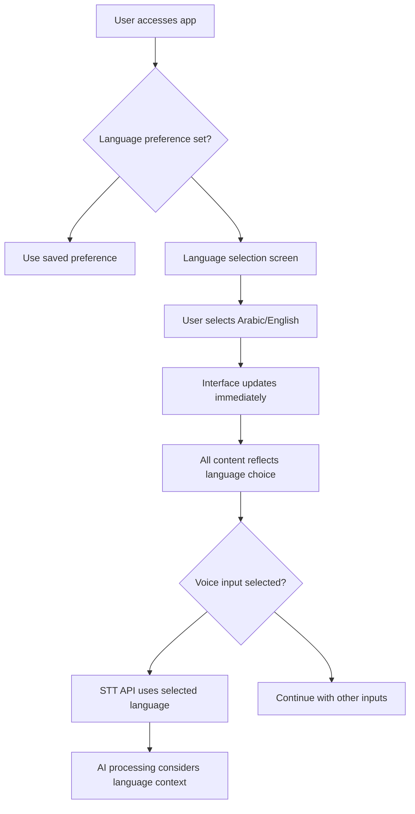

# 🎯 User Journey Flows - AI Personal Finance Tracker

| Date | Version | Description | Author |
| :--- | :--- | :--- | :--- |
| 2025-09-23 | 1.0 | Initial user journey documentation addressing PM checklist UX gaps | BMad Master |

## Overview

This document provides comprehensive user journey flows for the AI Personal Finance Tracker, addressing the UX requirements identified in the PM checklist validation. It covers primary use cases, decision points, error scenarios, and recovery paths to ensure seamless user experience implementation.

## Primary User Personas

**Primary User**: **Financial Tracker** 
- Wants simple, quick expense logging
- Prefers minimal manual data entry
- Values accuracy and categorization
- Uses mobile/web interface interchangeably

## Core User Journey Flows

---

## 🚀 **Flow 1: Quick Transaction Entry (Text Input)**

### Happy Path - Successful AI Extraction

```mermaid
graph TD
    A[User lands on Dashboard] --> B[Clicks text input field]
    B --> C[Types: "50 EGP lunch at McDonald's"]
    C --> D[Clicks Send/Submit]
    D --> E[System sends to LLM API]
    E --> F[AI extracts: Amount=50, Currency=EGP, Category=Food, Description=lunch at McDonald's]
    F --> G[Confirmation modal appears with extracted data]
    G --> H{User reviews data}
    H --> I[User clicks 'Confirm']
    I --> J[Select account dropdown appears]
    J --> K[User selects 'Cash' account]
    K --> L[Transaction saved to database]
    L --> M[Success notification shown]
    M --> N[Dashboard updates with new transaction]
    N --> O[User sees updated balance]
```

### Decision Points & User Actions:
1. **Text Input Decision**: User chooses text over voice/image
2. **Confirmation Review**: User validates AI extraction accuracy
3. **Account Selection**: User assigns transaction to specific account
4. **Final Confirmation**: User commits transaction to database

### Key UX Requirements:
- ✅ Input field prominently displayed on dashboard
- ✅ Real-time typing feedback (character count, formatting hints)
- ✅ Loading indicator during AI processing
- ✅ Clear confirmation modal with editable fields
- ✅ Account selection with visual balance indicators

---

## 🎤 **Flow 2: Voice Transaction Entry**

### Happy Path - Voice to Transaction



### Voice-Specific UX Requirements:
- ✅ Clear recording permissions flow
- ✅ Visual recording feedback (waveform, timer)
- ✅ Ability to re-record if transcription is wrong
- ✅ Audio playback option for verification
- ✅ Fallback to text input if voice fails

---

## 📸 **Flow 3: Receipt Image Upload**

### Happy Path - Image to Transaction



### Image-Specific UX Requirements:
- ✅ Camera permissions and fallback options
- ✅ Image quality guidance (lighting, angle, focus)
- ✅ Crop/rotate tools for receipt optimization
- ✅ Multiple transaction handling from single receipt
- ✅ Receipt text preview before AI processing

---

## ⚠️ **Error Scenarios & Recovery Paths**

### AI Extraction Failures - Recovery Flows

#### **Scenario 1: Low Confidence AI Extraction**



#### **Scenario 2: Complete AI Service Failure**



#### **Scenario 3: Ambiguous Input Detection**



### Error Recovery UX Requirements:
- ✅ Clear error messaging with actionable next steps
- ✅ Preserve user input during errors (no data loss)
- ✅ Multiple recovery options (retry, manual, modify)
- ✅ Learn from user corrections to improve AI accuracy
- ✅ Offline mode for manual entry when services unavailable

---

## 🏦 **Flow 4: Account Management Journey**

### Account Selection During Transaction



### Account Management UX Requirements:
- ✅ Account balances visible during selection
- ✅ Quick account creation without leaving transaction flow
- ✅ Account type icons and color coding
- ✅ Default account suggestion based on transaction category
- ✅ Recent account priority in dropdown

---

## 🔄 **Flow 5: Transaction Correction & Editing**

### Post-Transaction Correction Flow



### Correction Flow UX Requirements:
- ✅ Easy access to edit any transaction
- ✅ Clear change highlighting and confirmation
- ✅ Automatic balance recalculation
- ✅ Change history/audit trail (future enhancement)
- ✅ Bulk edit capabilities for similar transactions

---

## 📊 **Flow 6: Dashboard Overview & Navigation**

### Dashboard Landing Experience



### Dashboard UX Requirements:
- ✅ Clear financial overview at first glance
- ✅ Quick access to all input methods
- ✅ Recent activity for immediate context
- ✅ Progressive disclosure of advanced features
- ✅ Responsive design for mobile/desktop usage

---

## 🌍 **Flow 7: Multi-Language Support**

### Language Selection & Content Flow



### Multi-Language UX Requirements:
- ✅ Seamless language switching without data loss
- ✅ RTL/LTR layout adaptation for Arabic
- ✅ Currency and number format localization
- ✅ Voice recognition language matching
- ✅ Mixed language transaction support

---

## 🎯 **Critical Decision Points Summary**

### User Decision Matrix

| Decision Point | Options | Default Behavior | Recovery Actions |
|---|---|---|---|
| **Input Method** | Text, Voice, Image | Text (most prominent) | Switch methods anytime |
| **AI Confidence** | Accept, Modify, Manual | Auto-accept if >90% | Review mode if <90% |
| **Account Selection** | Existing, Create New | Most recent account | Quick creation modal |
| **Error Handling** | Retry, Manual, Skip | Auto-retry once | Clear error messaging |
| **Language Context** | Arabic, English, Mixed | User's browser locale | Manual override available |

---

## 📋 **Implementation Priority**

### Phase 1 - MVP (Current Epic 2-4 Scope)
- ✅ Text input transaction flow
- ✅ Basic error handling and manual fallback
- ✅ Account selection during transaction
- ✅ Transaction confirmation and editing

### Phase 2 - AI Enhancement (Epic 3)
- ✅ Voice input flow with STT integration
- ✅ Image upload flow with OCR processing
- ✅ AI confidence handling and disambiguation
- ✅ Multi-modal input switching

### Phase 3 - Advanced UX (Future Enhancements)
- 🔄 Bulk transaction operations
- 🔄 Smart categorization learning
- 🔄 Offline mode and sync
- 🔄 Advanced analytics navigation

---

## 🔍 **UX Validation Checklist**

### Must-Have UX Elements:
- [ ] Clear visual feedback for all user actions
- [ ] Loading states for all async operations
- [ ] Error messages with actionable next steps
- [ ] Consistent navigation patterns across flows
- [ ] Mobile-first responsive design
- [ ] Accessibility compliance (WCAG 2.1)
- [ ] Performance optimization for AI processing delays

### Success Metrics:
- **Task Completion Rate**: >95% for primary transaction flows
- **Error Recovery Rate**: >90% of users successfully recover from AI failures
- **Time to Transaction**: <30 seconds from input to saved transaction
- **User Satisfaction**: >4.5/5 rating for ease of use

---

## 📝 **Next Steps for Implementation**

1. **Create wireframes** for each critical decision point identified
2. **Design confirmation modals** with proper field validation
3. **Implement progressive error handling** with clear recovery paths
4. **Build responsive components** supporting all identified flows
5. **Test multi-language support** with actual Arabic/English content

---

**Document Status**: ✅ **COMPLETE** - Addresses PM Checklist UX requirements gap  
**Integration**: Ready for architecture phase and Epic 2-4 implementation  
**Review**: Periodic updates based on user testing feedback
